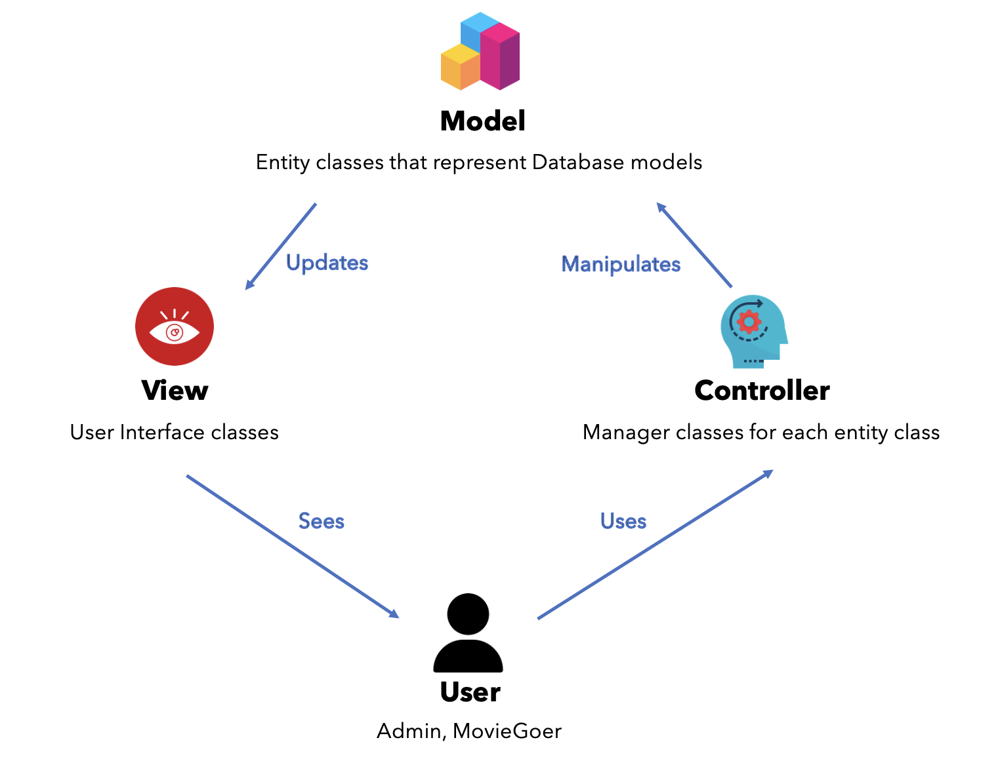

# Moblima-SC2002
## Object-Oriented Design and Programming 

### MOvie Booking and LIsting Management Application (MOBLIMA)

MOBLIMA is an application to computerize the processes of making online booking and
purchase of movie tickets, listing of movies and sale reporting. It will be used by the moviegoers and cinema staff.

### Preface
This project is an assignment for our module deliverables (SC2002/CZ2002) and is not intended for any use outside of this scope. 

-------------------

### Design Principles
In the design of this project, we took into consideration the EAIP (Encapsulation, Abstraction, Inheritance, Polymorphism) Principles in OOP as well as the SOLID principles. 

These principles, in conjuction with the Model-View-Controller (MVC) framework enabled us to structure our project to achieve loose-coupling and high cohesion. 

The quintessential concepts learnt in this course have proved imperative in the design process of this application.

The overview of our architecture is as such:

------------------

### Data Dictionary

| Term | Definition                                                                         |
|---|------------------------------------------------------------------------------------|
| Show | The instance of a movie screening at the cinema                                    |
| Movie Type | Type of movie, such as 2D, 3D or Blockbuster                                       |
| Theatre Class | Type of theatre, such as standard or platinum                                      |
| Movie Goer | Customer planning to watch a movie                                                 |
| Guest | An unauthenticated Movie Goer that will be prompted to sign up upon ticket booking |

------------------

### Assumptions Made

In the design of our application, we made the following assumptions:
1. No concurrent access as it is a single-user application.
2. Currency is in SGD and inclusive of Goods and Service Tax (GST).
3. There is no need for additional security features such as password encryption.
4. Payment will always be successful.
5. Our application does not interact with external services such as online payment services (VISA, MasterCard, PayLah etc).
6. There is no need for validation when purchasing discounted tickets such as Student/Senior Citizen tickets as this will be done upon entry to the theatre.
7. Not all MovieGoers will be logged in from the start. (We circumvented this by allowing users to purchase tickets as Guests. After purchasing a ticket, our application will prompt users to create an account.)
8. Users will not be allowed to create accounts with identical usernames. This applies to both Admins and MovieGoers. (We implemented a check to enforce this.)
9. Admins will not be allowed to create a new Show instance if its show-time conflicts with that of another show in the same theatre in the same cineplex on the same date. (We implemented a check to enforce this.)
10. Some holidays fall on different dates every year. Thus, we tagged each Holiday instance to the year it corresponds to for greater clarity (e.g. Chinese New Year 2022).
11. All students are of legal age (i.e. students can watch shows irregardless of movie rating)

-----------
 
 
 

### Contributors

The following members contributed to the success of this project through their hard work and sleepless nights.
In no particular order:

1. Chan Ming Han (Computer Engineering)
   https://www.linkedin.com/in/chan-ming-han-601b531ba/ 

2. Wayne Tan Jing Heng (Computer Science)
   https://www.linkedin.com/in/wayne-tan-jh/

3. Lim Sui Kiat (Computer Science)
   https://www.linkedin.com/in/sui-kiat-lim/

4. Ho Han Yu (Computer Science)
   https://www.linkedin.com/in/hohanyu/

5. Yap Zhe Kai, Nicholas (Computer Science)
   https://www.linkedin.com/in/nicholas-yap-5706311b7/
